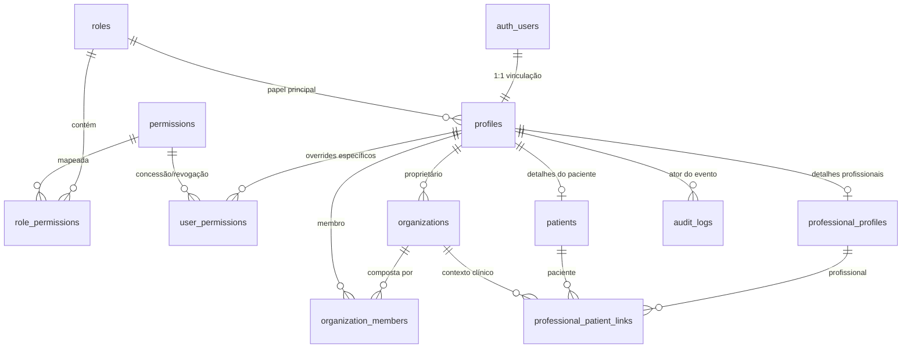

# Arquitetura da Plataforma SaaS de Nutrição & Treinamento
*Documento de Fundamentação Técnica, Segurança e Escalabilidade*

---

## 1. Visão Geral da Arquitetura

O sistema é projetado para operar como uma plataforma SaaS multi-tenant voltada para o mercado de nutrição e treinamento físico, priorizando:
- **Segurança profunda (Defense in Depth)**: RLS em nível de banco de dados, guards server-side e proteção na borda (Edge Middleware).
- **Isolamento multiusuário estrito**: Prevenção ativa contra IDOR (Insecure Direct Object Reference) e vazamento de dados entre profissionais e pacientes.
- **Diferenciação clara entre perfis de atuação**: Tratamento específico para Nutricionistas (atuação clínica) e Influenciadores (comunidade e programas), além de Administradores e Pacientes.
- **Multi-organização extensível**: Suporte natural a profissionais solo, clínicas com múltiplos profissionais e equipes de consultoria.

---

## 2. Stack Tecnológica

| Camada | Tecnologia | Papel no Sistema |
|---|---|---|
| **Frontend & SSR** | Next.js (App Router) + React 19 | Renderização no servidor, Server Actions e UI responsiva |
| **Linguagem** | TypeScript | Tipagem estática rigorosa de domínio e contratos |
| **Estilização** | Tailwind CSS | Sistema visual moderno com paleta escura (Dark theme) |
| **Banco de Dados** | PostgreSQL (Supabase) | Armazenamento relacional com suporte a JSONB, Triggers e RLS |
| **Autenticação** | Supabase Auth (`@supabase/ssr`) | Sessões por cookies seguros, refresh de tokens e JWT |
| **Validação** | Zod | Sanitização e validação de schemas em todas as entradas |
| **Testes** | Vitest | Testes automatizados de RBAC, integridade de schema e validações |

---

## 3. Modelo de Domínio e Banco de Dados

### 3.1. Entidades Principais



### 3.2. Descrição das Tabelas

1. **`roles`**: Papéis canônicos da plataforma:
   - `admin`: Governança e auditoria completa.
   - `nutritionist`: Prescrição clínica de dietas e treinos.
   - `influencer`: Gestão de comunidades e programas (sem prescrição clínica).
   - `patient`: Consumidor final de dietas e treinos pessoais.
2. **`permissions`**: Catálogo de permissões granulares (`patient.view`, `patient.edit`, `nutrition.view`, `nutrition.edit`, `workout.view`, `workout.edit`, `progress.view`, `ai.use`, `ai.manage`, `products.manage`, `entitlements.manage`, `billing.manage`, `users.manage`).
3. **`role_permissions`**: Mapeamento padrão entre papéis e permissões.
4. **`profiles`**: Dados gerais do usuário (`full_name`, `email`, `avatar_url`, `is_active`, `role_id`).
5. **`user_permissions`**: Permissões individuais concedidas ou revogadas pontualmente por usuário.
6. **`organizations`**: Suporte a clínicas, estúdios ou práticas isoladas.
7. **`organization_members`**: Associação de profissionais e membros às organizações (`owner`, `admin`, `member`).
8. **`professional_profiles`**: Especialização de perfil para nutricionistas (com registro de classe CRN) e influenciadores.
9. **`patients`**: Especialização de perfil para pacientes.
10. **`professional_patient_links`**: Associação explícita e auditável entre profissional e paciente:
    - Campo `is_primary` (indica titularidade do acompanhamento);
    - Campo `status` (`active`, `inactive`, `transferred`, `pending`);
    - Campo `link_type` (`direct`, `organization`, `influencer_referral`);
    - Histórico e observações do vínculo.
11. **`audit_logs`**: Registro central de segurança para auditoria e conformidade (`actor_id`, `action`, `entity_type`, `entity_id`, `metadata`, `ip_address`, `user_agent`).

---

## 4. Segurança e Row Level Security (RLS)

A aplicação segue a premissa de que **o frontend não é uma barreira de segurança confiável**. A proteção de dados opera no próprio PostgreSQL através de RLS habilitado em 100% das tabelas.

### 4.1. Funções de Apoio em Schema Privado (`private.*`) com `SET search_path = ''`
Todas as funções auxiliares de autorização sensíveis foram movidas para o schema isolado `private`, com `SET search_path = ''` e referências totalmente qualificadas para eliminar completamente qualquer risco de *search path hijacking* (CWE-426):
- `private.get_user_role(target_user_id)`: Retorna o papel seguro do usuário.
- `private.is_admin(target_user_id)`: Valida se o usuário possui papel de administrador.
- `private.is_professional(target_user_id)`: Valida se é nutricionista ou influenciador.
- `private.can_access_patient(prof_id, pat_id)`: Verifica se existe vínculo ativo (`status = 'active'`) em `public.professional_patient_links`. Vínculos inativos ou transferidos revogam o acesso imediatamente.
- `private.is_org_member(org_id, user_id)`: Verifica adesão à organização.
- `private.can_manage_org_members(target_org_id, actor_id)`: Restringe a gestão de membros estritamente aos proprietários/administradores daquela organização específica ou ao administrador do sistema.

Permissões de execução:
- `REVOKE ALL ON ALL FUNCTIONS IN SCHEMA private FROM PUBLIC, anon, authenticated;`
- Concedido apenas `USAGE ON SCHEMA private` e `EXECUTE` estritamente nas funções necessárias para avaliação de RLS aos papéis `authenticated` e `service_role`.

### 4.2. Políticas e Mecanismos do Security Gate
- **Perfis (`profiles`)**: Usuário lê e atualiza seu próprio perfil; profissional lê perfis de pacientes com vínculo ativo; paciente lê perfil do seu profissional; admin lê todos.
- **Prevenção Total de Autoelevação no Cadastro**: O trigger `handle_new_user` atribui **incondicionalmente** o papel `'patient'` a qualquer auto-cadastro público. Nenhuma chamada de API, request manipulado ou metadata enviado pelo cliente (`role_id: 'admin'`, `'nutritionist'`, `'influencer'`) consegue criar contas profissionais ou administrativas. Os papéis `ADMIN`, `NUTRITIONIST` e `INFLUENCER` são provisionados exclusivamente via fluxos administrativos seguros, convites ou aprovação prévia.
- **Imutabilidade de Papéis**: Trigger `trg_prevent_unauthorized_role_change` bloqueia qualquer tentativa de alteração de `role_id` por usuários comuns.
- **Pacientes (`patients`)**: Paciente lê apenas seu próprio registro (`id = auth.uid()`); profissional só lê se `private.can_access_patient()` retornar verdadeiro. Tentativas de IDOR retornam 0 linhas no PostgreSQL.
- **Vínculos (`professional_patient_links`)**: Visíveis apenas para as partes envolvidas; o Profissional A não pode consultar, alterar ou excluir vínculos do Profissional B.
- **Permissões de Usuário (`user_permissions`)**: Escrita restrita a administradores. Usuários comuns só podem inspecionar suas próprias concessões.
- **Isolamento de Organizações**: Membros de uma clínica não podem visualizar organizações ou membros de outras clínicas.
- **Auditoria Append-Only & Anti-Spoofing**:
  - Inserções via `log_audit_event` forçam `actor_id = auth.uid()`, neutralizando qualquer tentativa do cliente de forjar o identificador de outro usuário.
  - Trigger em nível de declaração (`FOR EACH STATEMENT`) `trg_prevent_audit_tampering` bloqueia `UPDATE` e `DELETE` em `audit_logs` para **todos os usuários e administradores da aplicação**, criando um livro-razão imutável (*append-only ledger*).
  - *Modelo de Ameaça do Registro de Auditoria*: A imutabilidade garante proteção integral contra violações em nível de aplicação e comprometimento de contas administrativas. Em termos formais de segurança de banco de dados, ela não se estende a superusuários/DBAs do próprio PostgreSQL com acesso direto ao disco ou privilégios de root no SGBD.
  - Leitura de `audit_logs` restrita exclusivamente a administradores via RLS.

---

## 5. Arquitetura de Software e Código

```
appnutri/
├── supabase/
│   └── migrations/
│       ├── 20260907000001_initial_schema.sql         # Criação das 11 tabelas do domínio
│       ├── 20260907000002_rbac_and_permissions.sql   # Seed de papéis e matriz de permissões
│       ├── 20260907000003_rls_policies.sql           # Funções SECURITY DEFINER e políticas RLS
│       ├── 20260907000004_audit_and_triggers.sql     # Triggers de auth, perfil e audit log
│       └── 20260907000005_seed_initial_data.sql     # Verificação de integridade da fundação
├── src/
│   ├── app/
│   │   ├── (auth)/
│   │   │   ├── actions.ts           # Server Actions: login, registro, logout com auditoria
│   │   │   ├── login/page.tsx       # Formulário de login
│   │   │   └── register/page.tsx    # Formulário de cadastro com seletor de perfil
│   │   ├── (protected)/
│   │   │   ├── dashboard/page.tsx   # Painel com nome, email, papel e organização
│   │   │   ├── admin/page.tsx       # Área administrativa (guard requireRole('admin'))
│   │   │   ├── professional/page.tsx# Área profissional (nutri vs influencer)
│   │   │   └── patient/page.tsx     # Portal do paciente (guard requireRole('patient'))
│   │   ├── unauthorized/page.tsx    # Página de erro 403 (Acesso Negado)
│   │   ├── layout.tsx               # Layout raiz com Navbar global e tema escuro
│   │   └── page.tsx                 # Página inicial pública
│   ├── components/
│   │   ├── layout/Navbar.tsx        # Barra de navegação com estado de autenticação
│   │   └── ui/RoleBadge.tsx         # Identificador visual de papel
│   ├── lib/
│   │   ├── supabase/
│   │   │   ├── client.ts            # Cliente Browser (@supabase/ssr)
│   │   │   ├── server.ts            # Cliente Server (@supabase/ssr com cookies assíncronos)
│   │   │   ├── admin.ts             # Cliente Admin (Service Role Key, bloqueado no browser)
│   │   │   └── middleware.ts        # Atualizador de sessão e refresh de tokens
│   │   ├── auth/
│   │   │   ├── session.ts           # Obtenção do usuário autenticado e permissões efetivas
│   │   │   ├── roles.ts             # Verificadores de papel e permissão
│   │   │   └── guards.ts            # Guards server-side (requireAuth, requireRole, requirePermission)
│   │   ├── audit/
│   │   │   └── logger.ts            # Emissor de logs de auditoria no banco
│   │   └── validations/
│   │       └── auth.ts              # Schemas Zod para autenticação e vínculos
│   ├── middleware.ts                # Middleware de borda para proteção de rotas
│   └── types/
│       ├── roles.ts                 # Tipos e enums de papéis
│       ├── permissions.ts           # Tipos de permissões e matriz padrão
│       ├── database.ts              # Tipos TypeScript das tabelas PostgreSQL
│       └── auth.ts                  # Tipos da sessão do usuário
├── tests/
│   ├── rbac.test.ts                 # Testes unitários do RBAC e distinção de papéis
│   ├── validation.test.ts           # Testes dos schemas Zod
│   └── migrations.test.ts           # Testes de integridade das migrações SQL
├── package.json
└── tsconfig.json
```

---

## 6. Rotas e Matriz de Acesso

| Rota | Acesso Permitido | Ação em Caso de Violação |
|---|---|---|
| `/` | Público | Livre |
| `/login` | Público (redireciona para `/dashboard` se autenticado) | Redirecionamento automático |
| `/register` | Público (redireciona para `/dashboard` se autenticado) | Redirecionamento automático |
| `/dashboard` | Qualquer usuário autenticado | Redireciona para `/login?redirect=/dashboard` |
| `/admin` | Exclusivo `admin` | Redireciona para `/unauthorized` (403) |
| `/professional` | Exclusivo `nutritionist` e `influencer` | Redireciona para `/unauthorized` (403) |
| `/patient` | Exclusivo `patient` | Redireciona para `/unauthorized` (403) |
| `/unauthorized` | Público | Exibe tela de privilégio insuficiente |

---

## 7. Garantias de Não-Vazamento e IDOR

1. **Tentativa de IDOR via Parâmetros de URL**: Mesmo que um nutricionista envie uma requisição contendo o ID de um paciente de outro nutricionista, a política RLS `can_access_patient(auth.uid(), target_patient_id)` retornará vazio na camada de banco de dados.
2. **Exposição de Chaves de Serviço**: A chave `SUPABASE_SERVICE_ROLE_KEY` é estritamente de servidor e validada com verificação `typeof window !== 'undefined'` em `src/lib/supabase/admin.ts`.
3. **Escalação de Privilégios no Cadastro**: O trigger de banco valida o papel desejado e impede a injeção de atributos não permitidos. Atualizações posteriores em `role_id` são bloqueadas por trigger dedicado.
